**` Software Developer Student  `** 

  

  
  

  <a href="https://instagram.com/_macsousa">You can Support Me By Clicking Here!</a>

## ☕︎+⏱+💻࣪࣪&nbsp;**`Tech Stack`**
### **`Languages and Tools`**
| Python3 | HTML | CSS | JavaScript | PHP | Oracle |
|----------|----------|----------|--------|----------|----------|
|   |   |   | | |||

#

### **`Environments, Testing, Other`**

| Git | Visual Studio |
|----------|----------|
|  ||

#
                                       
## 📊&nbsp;**`Analytics`**

  
  

#

## 👾

